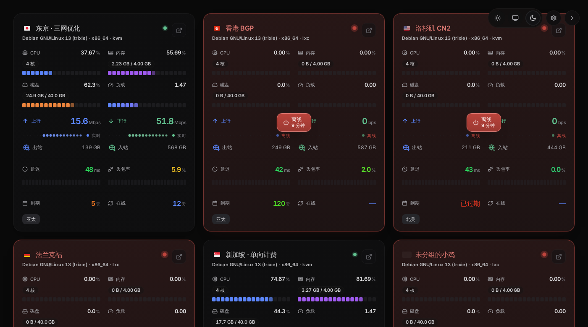

# monitor-theme-Lumina

[monitor](https://github.com/monitor-probe/monitor) 的状态页主题，移植自 [stqfdyr/komari-theme-Lumina](https://github.com/stqfdyr/komari-theme-Lumina) —— 面向 Komari 的同名主题。

首页是卡片式的高密度节点列表，详情页整合了负载与延迟图表。React 19 + Vite + Tailwind 4 + uPlot。



## 安装

在 hub 后台「主题」页上传 `theme.tar.gz`，或者把主题目录放进 hub 的 `--themes` 位置（一键部署的默认值是 `/opt/monitor/data/themes/`），目录名必须是 `lumina`。之后在后台选中它，无需重启。

也可以下载 release 里的 `theme.tar.gz`，用 `gzip -t` 校验一下再传。

## 路由

| 路径 | 内容 |
|---|---|
| `/` | 节点卡片列表 |
| `/instance/{id}` | 单个节点的详情与图表 |

`/admin`、`/api`、`/install.sh`、`/agent/*` 由 hub 接管，不属于主题。

**`/instance/{id}` 要在反代或 WAF 上放行。** 从列表点进详情只是 `pushState`，边缘看不见请求；只有**刷新详情页**才会真的请求这个前缀。症状是「点进去正常、一刷新就被拦」。

## 主题设置

设置项声明在 `theme.json` 的 `config` 里，站长在 hub 后台「主题」页调整。主题用 `GET /api/themes/lumina/config` 读取，任何失败都静默回落到默认值。

| 设置 | 默认 | 作用 |
|---|---|---|
| 默认外观 | 跟随系统 | 浅色 / 深色 / 跟随系统。访客自己切换过之后跟随访客 |
| 显示后台入口 | 开 | 右下角悬浮按钮里的齿轮，指向 `/admin/` |
| 离线节点排在最后 | 关 | 只把离线的整体移到后面，不改变站长拖出来的相对顺序 |
| 卡片显示延迟与丢包 | 开 | 见下方「延迟条的开销」 |
| 显示网络延迟页签 | 开 | 关掉则详情页只剩负载图表 |
| 默认时间范围 | 6 小时 | 打开详情页时先画的范围 |

站点级设置一律走这里，只有访客自己的外观选择进 localStorage。

### 延迟条的开销

首页每张卡片每分钟向 hub 查一次该节点最近一小时的探测历史。hub 的历史查询走一个**只有 4 个名额**的信号量，而且是排队超过就返回 503 而不是等 —— 每个查询都占着 agent 上报用的那条 SQLite 连接。

主题这边做了三件事来收敛压力：并发限制在 3 个请求；最近上报早于窗口起点的节点直接跳过（离线节点不产生查询）；被 503 挡回来时保留上一次的显示并退避 5 分钟。即便如此，节点很多时这些查询仍会占用 hub 的查询名额，**关掉这个开关可以省下这部分开销**。

## 开发

主题只读公开数据，任何一个开着状态页的 hub 都能当数据源：

```bash
npm ci
MONITOR_HUB=https://hub.example.com npm run dev
```

不设 `MONITOR_HUB` 时 `vite` 把 `/api` 与 WebSocket 代理到 `http://127.0.0.1:9911`。在本机起 hub 的写法见文档站的[主题开发](https://monitor-document.pages.dev/dev/theme)页。

构建产物在 `dist/`。提交前跑 `npm run build && npm run lint && npm test`。

`npm test` 盯的是 `src/utils/adapters.ts` 里那几个错了不显眼的地方 —— 流量比的是哪个口径、到期天数谁来算、一条坏上报怎么处置、探测顺序按什么定。没有测试框架，node 自己剥掉类型，失败时退出码非零。

## 打包

```bash
npm run build && npm run package     # 产出 theme.tar.gz
```

包里是一个可直接安装的主题目录：`dist/` + `theme.json` + `preview.png`。这与 hub 从磁盘读主题时的布局一致，也与会发布到 release 的包完全一样。

## 发版

改动记在 [CHANGELOG.md](./CHANGELOG.md)。发布步骤：

1. 把改动写进 `[未发布]` 一节
2. 发布时新开 `## [x.y.z] - YYYY-MM-DD`，把 `[未发布]` 的内容挪进去
3. `theme.json`、`package.json`、`package-lock.json` 三个版本号都改成 `x.y.z`
4. 打 tag `vx.y.z` 推送

推送 tag 会触发 `release.yml`：先卡 tag 与 `theme.json` 的版本号是否相等，再从 CHANGELOG 里取出这一版的一节当 release 说明（**取不到就直接失败**，不会发出一个没有说明的 release），然后构建、打包、校验包内容，最后附上 `theme.tar.gz` 与它的 sha256 发 release。

手动触发同一个工作流只构建打包、留个 artifact 供下载，不发 release —— 用来在不打 tag 的情况下验证这条流水线。

`npm run changelog -- <版本号>` 可以在本地把某一节的说明打出来看看。

`ci.yml` 在推 main 和开 PR 时跑 lint / test / build，并检查三个文件的版本号是否一致。

## 用到的 hub 接口

全部同源，全部只读：

| 接口 | 用途 |
|---|---|
| `GET /api/me` | 站名、登录状态、公开页开关 |
| `GET /api/nodes` | 节点列表与实时指标（WebSocket 断开时的回退） |
| `GET /api/ws` | 每 2 秒推送一帧完整节点快照 |
| `GET /api/nodes/{id}/metrics` | 历史指标与延迟记录 |
| `GET /api/themes/lumina/config` | 站长改过的设置 |

## 与上游 Lumina 的差异

上游是给 Komari 写的，数据模型有几处对不上，移植时按 monitor 的能力做了取舍：

- **详情页只画四张历史图**（CPU / 内存 / 磁盘 / 网络）。hub 的历史表只存这四样加聚合列，Swap、负载均值、进程数、连接数都只有实时值、不落盘。这四项在详情页的信息栏里照常显示，只是没有曲线。
- **首页延迟条用节点自己的探测**。monitor 没有公开的 Ping 任务列表接口（那是管理员接口），但每个节点被分配到的探测可以匿名读到（`probes` 随样本一起下发）。所以不需要上游那套「把任务绑定到卡片」的配置。一个节点挂了多个探测时只画**第一个**（按 hub 给的顺序，即后台里探测的排列顺序）—— 把两个不同目标的探测取平均，得到的是对谁都不成立的数。
- **站内设置面板没有了**，设置改到 hub 后台。上游的 `?view=theme-manage` 面板同时承担「首页 Ping 绑定」，而绑定这件事在 monitor 里由 hub 后台的探测分配决定，主题这边不需要。
- **没有标签**。monitor 的节点模型没有 tags，卡片底部只显示分组。
- **到期天数用 hub 给的 `expires_in`**，不拿浏览器时钟算。hub 按自己的日历数，和续费、掉线通知口径一致；用浏览器时钟算，hub 跑 UTC、访客在 UTC+8 时会每个周期提前八小时显示「已过期」。
- **流量进度条比的是本计费周期的用量**（`month_used`），不是累计流量。monitor 的 `traffic_limit` 是按 `traffic_mode` 计的每周期上限，拿一年的累计量去除它，一台开了半年的机器会画成 1000%。
- **付款周期按 monitor 的写法读**：`monthly` / `quarterly` / … 或 `<n>m` / `once`，不是天数。
- **网络图多了一条峰值线**。hub 会落盘每个桶内的峰值网速（agent 每个上报间隔测一次），上游的 Komari 没有这个数据。

## 许可

MIT，见 [LICENSE](./LICENSE)。

本仓库是 [stqfdyr/komari-theme-Lumina](https://github.com/stqfdyr/komari-theme-Lumina) 的移植（Komari → monitor），界面设计与绝大部分样式来自上游，数据层为适配 monitor 的公开接口重写。

`public/assets/flags/` 下的 258 个国旗图标看上去来自 [circle-flags](https://github.com/HatScripts/circle-flags)（MIT）。
